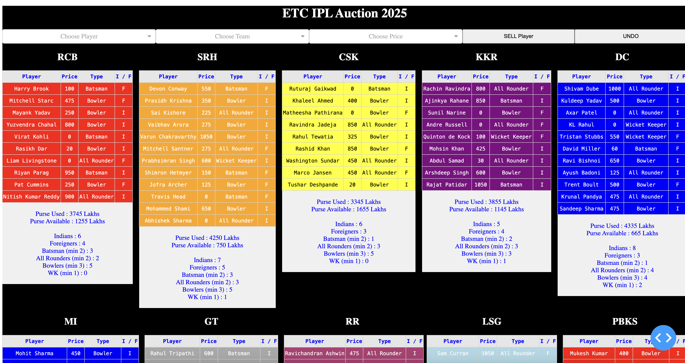

# IPL Auction 

This project provides an application for IPL auction, built using Dash in Python. 

## Installation

1. Install the required dependencies:
   ```sh
   pip install -r requirements.txt
   ```

## Project Structure

- **IPL 2024 Folder**: Contains data of ETC Auction 2024 which had 8 teams.
- **IPL 2025 Folder**: Contains data of ETC Auction 2025 which had 10 teams.

## Usage

1. Navigate to the desired season folder:
   ```sh
   cd IPL_2024   # or cd IPL_2025
   ```
2. Run the dashboard:
   ```sh
   python dashboard.py
   ```
3. Open the dashboard in your browser at:
   ```
   http://127.0.0.1:8050/
   ```

## Key Highlight

- **Undo Option** : In case of wrong entry
- **Persistent Storage** : Incase of crash or closing the app, the data of sold players is stored in db, and loads again seamlessly when re-run

## Screenshot




